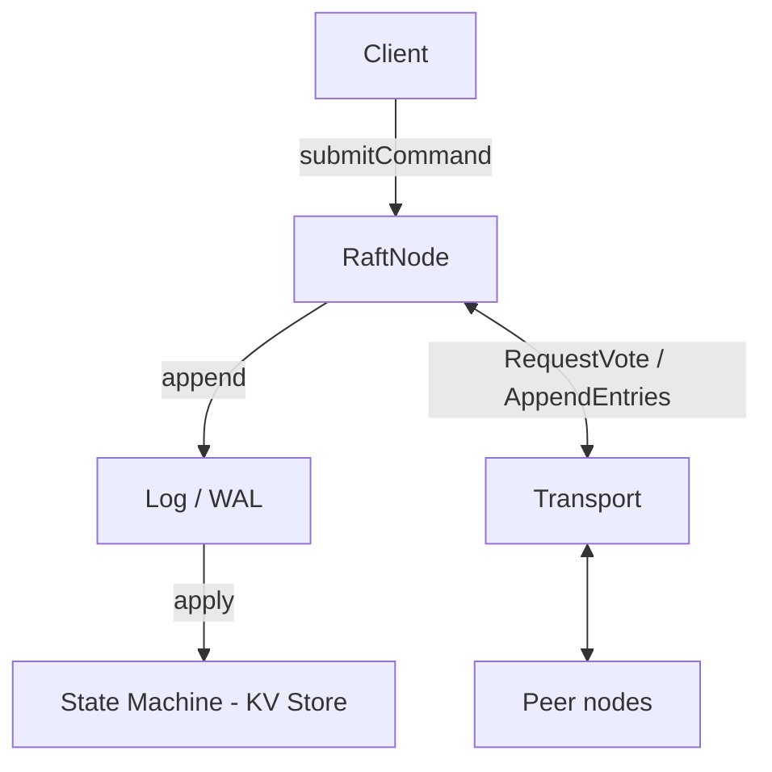

# 🌰 Granary

A [Raft][raft] consensus implementation in [Zig][zig], backing a replicated key-value store.

> [!NOTE]
> Granary is a research project, a way to learn [Zig] and have some fun implementing [Raft] straight from the paper.
> It is **not** production-ready. There's no real network transport or on-disk persistence yet; see [Status](#status) for what works and what doesn't.

[zig]: https://ziglang.org/
[raft]: https://raft.github.io/

## Why "Granary"?

An Acorn Woodpecker group works together to maintain and defend a shared store of acorns. The same
tree, the _granary_, gets reused across generations to hold the winter food supply. No single bird
owns it; the flock keeps it consistent and durable together.

That's what a Raft cluster does with its log:

| Acorn Woodpeckers         | Granary (Raft)                                       |
| ------------------------- | ---------------------------------------------------- |
| The flock                 | The cluster of nodes                                 |
| The granary tree          | The replicated log, shared across all nodes          |
| Each acorn in a hole      | A committed command (`set` / `delete` / `get`)       |
| Defending the collection  | Leader election and replication keeping the log safe |
| Reused across generations | The write-ahead log, replayed to rebuild state       |

(Fittingly, _Specht_ is German for _woodpecker_.)

## Status

What's implemented today:

- **Leader election**: `RequestVote` RPC with term and log up-to-dateness checks (§5.2, §5.4)
- **Log replication**: `AppendEntries` RPC with conflict truncation and idempotent re-appends (§5.3)
- **Heartbeats**: empty `AppendEntries` sent on a heartbeat interval
- **Tick-based event loop**: a logical clock with randomized election timeouts and jitter
- **Key-value state machine**: in-memory `set` / `delete` / `get`, applied in log order
- **WAL replay**: state gets rebuilt by replaying a log of commands
- **Binary wire format**: `serialize` / `deserialize` for commands, payloads, and RPCs
- **Type-erased transport**: a vtable interface in the style of `std.mem.Allocator`, with an in-memory test transport

Not yet built:

- A real network transport. Only in-memory and no-op transports exist today.
- On-disk persistence. The WAL binary format is defined and serializable, but nothing flushes it to disk or loads it back yet.
- Separate `commitIndex` / `lastApplied` advancement with a dedicated apply loop.
- Snapshots and log compaction.
- Cluster membership changes.

## Architecture



A command submitted to the leader gets appended to the log, replicated to peers over the transport,
then applied to the key-value state machine. Reads (`get`) flow through the log the same way writes
do, which makes them trivially linearizable.

### Modules

The source splits into small internal modules, each importable by name (see `build.zig`):

| Module      | Path             | Responsibility                                                             |
| ----------- | ---------------- | -------------------------------------------------------------------------- |
| `log`       | `src/log/`       | Command types, log payloads and entries, the in-memory log, wire format    |
| `state`     | `src/state/`     | The key-value state machine (`Store`) that commands apply to               |
| `transport` | `src/transport/` | The type-erased transport interface and RPC message types                  |
| `node`      | `src/node/`      | `RaftNode`, the Raft protocol itself: election, replication, the tick loop |
| `testing`   | `src/testing/`   | Test helpers, including an in-memory `MemTransport`                        |

### Commands

The state machine understands three commands, defined in `src/log/command.zig`:

- **`set(key, value)`** stores a value
- **`delete(key)`** removes a key
- **`get(key)`** reads a value, routed through the log so it linearizes against writes

### Write-Ahead Log format

Log entries serialize to a compact binary format with a per-file header and per-entry framing
(length, CRC32, then payload). The full byte layout lives in
[`docs/references/wal-format.md`](./docs/references/wal-format.md).

## Getting started

### Requirements

- Zig `0.17.0`, the version `.mise.toml` pins (`minimum_zig_version` in `build.zig.zon` is the oldest it supports)

If you use [mise](https://mise.jdx.dev/), `.mise.toml` declares the toolchain and the linters:

```sh
mise install
```

### Build, run, and test

```sh
zig build          # compile
zig build run      # run the executable
zig build test     # run the full test suite (all modules)
mise run check     # every gate CI runs: zig fmt --check, yamllint, actionlint, build, tests
```

The test suite is the best way into the code. Election, replication, WAL replay, conflict
truncation, and serialization round-trips each have focused tests in their own modules.

## Project layout

```text
src/
  main.zig            # executable entry point
  root.zig            # library root
  log/                # commands, payloads, log store, WAL serialization
  state/              # key-value state machine
  transport/          # transport interface + RPC messages
  node/               # RaftNode: the Raft protocol
  testing/            # in-memory transport and test helpers
docs/
  references/
    wal-format.md     # binary WAL layout
build.zig             # build graph and module wiring
```

## References

- [The Raft paper, _In Search of an Understandable Consensus Algorithm_][raft-paper]
- [raft.github.io][raft] for visualizations and resources
- [Zig language reference][zig]

[raft-paper]: https://raft.github.io/raft.pdf
