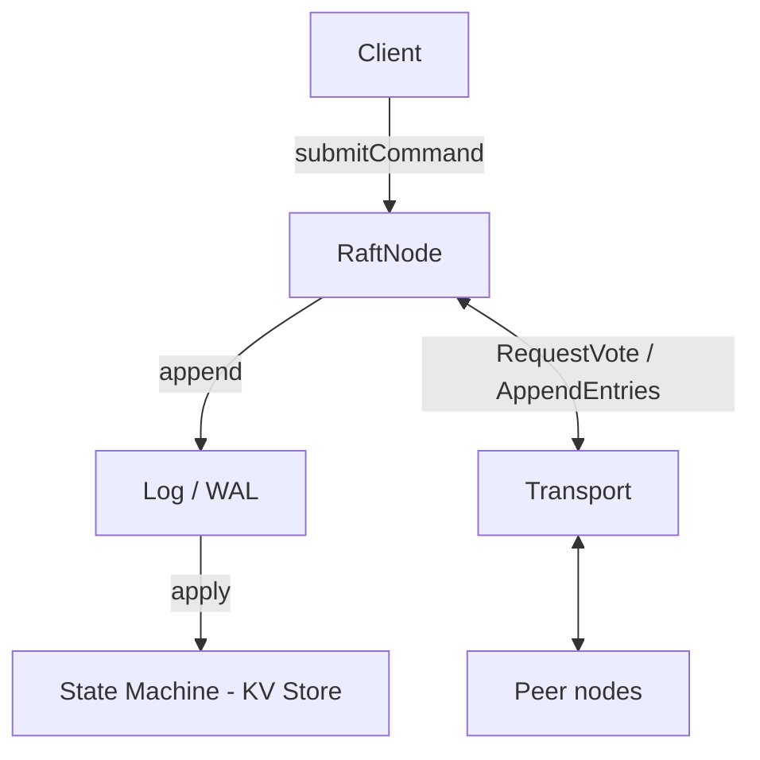

A command submitted to the leader gets appended to the log, replicated to peers over the transport, then applied to the key-value state machine. Reads (`get`) flow through the log the same way writes do, which makes them trivially linearizable.

## Modules

The source splits into small internal modules, each importable by name (see `build.zig`):

| Module      | Path             | Responsibility                                                             |
| ----------- | ---------------- | -------------------------------------------------------------------------- |
| `log`       | `src/log/`       | Command types, log payloads and entries, the in-memory log, wire format    |
| `state`     | `src/state/`     | The key-value state machine (`Store`) that commands apply to               |
| `transport` | `src/transport/` | The type-erased transport interface and RPC message types                  |
| `node`      | `src/node/`      | `RaftNode`, the Raft protocol itself: election, replication, the tick loop |
| `testing`   | `src/testing/`   | Test helpers, including an in-memory `MemTransport`                         |

## Commands

The state machine understands three commands, defined in `src/log/command.zig`:

- **`set(key, value)`** stores a value
- **`delete(key)`** removes a key
- **`get(key)`** reads a value, routed through the log so it linearizes against writes

## Write-ahead log

Log entries serialize to a compact binary format with a per-file header and per-entry framing (length, CRC32, then payload). The full byte layout, including the mermaid packet diagrams, lives on the [WAL Binary Format](/references/wal-format) page.
